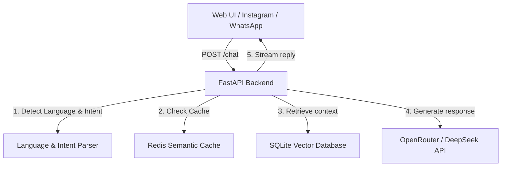

# NAPS Chatbot (RAG Architecture)

[](https://fastapi.tiangolo.com)
[](https://www.python.org)
[](https://redis.io)
[](https://sqlite.org)

An enterprise-ready conversational agent designed for **NAPS Maroc**, a leader in electronic payment solutions. The chatbot utilizes a high-performance **Retrieval-Augmented Generation (RAG)** pipeline and features native multilingual understanding (Moroccan Darija, French, Standard Arabic, English) coupled with a secure administrative dashboard.

---

## 🏗 High-Level Architecture

The chatbot backend is built on a clean asynchronous architecture designed for concurrency and minimal latency:



1. **FastAPI & Async Pipeline**: Handles incoming user messages concurrently using Python's `asyncio` and returns streaming server-sent events (SSE).
2. **Moroccan Darija & Multi-Language Logic**: High-accuracy Darija signal detection and state-based memory to keep conversations in the client's chosen language.
3. **Retrieval-Augmented Generation**: Extracts semantic embeddings using sentence-transformers, queries indexed document chunks in SQLite, and builds rich context for the LLM.
4. **Redis Semantic Cache**: Instantly resolves identical or semantically close queries without querying the LLM, reducing latency to <50ms.
5. **Secure WAL Database**: Uses SQLite configured in Write-Ahead Logging (WAL) mode for fast, concurrent read/write operations.

---

## 🚀 Core Features

### 1. Smart Welcome Screen & Static Buttons
- Interactive chips for quick actions: **Vos services**, **Nous contacter**, **Horaires**, and **À propos de NAPS**.
- **Forced French Responses**: Instantly delivers highly detailed and accurate responses in French, even during multi-language chat sessions.
- **SSE Newline-Safe Stream**: Custom chunk encoding to prevent line splitting in Server-Sent Events, ensuring clean markdown rendering.

### 2. Conversational Memory & Language Memory
- Seamlessly remembers context across messages.
- Advanced language lock-in: Prevents accidental language switching on short/neutral terms (e.g. "Oui", "D'accord", numbers).

### 3. Comprehensive Admin Dashboard
- **Analytics & Statistics**: Track message volumes, latency, cache hits, and active language distribution.
- **RAG Upload & Scraping**: Manage knowledge sources by uploading PDF/Docx files or entering URLs to scrape and index automatically.
- **Prompt Versioning**: Save, review, and rollback the system prompt through a revision history log.
- **History Viewer**: Inspect and edit live chat histories for any user.

---

## 📂 Repository Structure

```
├── cache/                  # Redis caching & conversation history memory
├── core/                   # Language detection, security checks, and RAG pipeline
├── database/               # SQLite models, engine, and database sessions
├── rag/                    # Text chunking, embedder, and vector retrieval
├── static/                 # CSS, JS, and media assets for UI templates
├── templates/              # Jinja2 templates for admin panel and chatbot UI
├── .env.example            # Environment variables template
├── main.py                 # Application entry point
├── requirements.txt        # Python dependency manifest
└── start_background.ps1    # Process detachment script for Windows host
```

---

## 🛠 Installation & Local Setup

### Prerequisites
- Python 3.11+
- Redis Server (local or cloud instance)
- PowerShell (if running on Windows)

### Steps

1. **Clone the repository**:
   ```bash
   git clone https://github.com/AstralDigital-ma/Naps.git
   cd Naps
   ```

2. **Create & activate a Virtual Environment**:
   ```bash
   python -m venv venv
   # Windows:
   .\venv\Scripts\Activate.ps1
   # Linux/macOS:
   source venv/bin/activate
   ```

3. **Install dependencies**:
   ```bash
   pip install -r requirements.txt
   ```

4. **Configure environment variables**:
   Duplicate `.env.example` to `.env` and fill in the values:
   ```env
   ADMIN_USER=admin
   ADMIN_PASS=admin123
   CHAT_JWT_SECRET=your-random-jwt-key
   OPENROUTER_API_KEY=your-openrouter-key
   REDIS_URL=redis://localhost:6379/0
   ```

5. **Start the Application**:
   - **Interactive Mode** (foreground):
     ```bash
     python main.py
     ```
   - **Background Mode** (detached on Windows host):
     ```powershell
     .\start_background.ps1
     ```

---

## 🔌 API Documentation

| Endpoint | Method | Auth | Description |
| :--- | :--- | :--- | :--- |
| `/chat` | `POST` | Header / Referer | Processes a message and streams SSE responses |
| `/ui` | `GET` | None | Accessible chatbot testing client interface |
| `/admin/login` | `GET/POST`| None | Administrator authentication route |
| `/admin/dashboard`| `GET` | Cookie Session| Access the chatbot management panel |
| `/admin/chunks` | `GET/POST`| Cookie Session| Edit, delete, and browse vectors/knowledge |

---
© 2026 Astral Digital & NAPS. All Rights Reserved.
